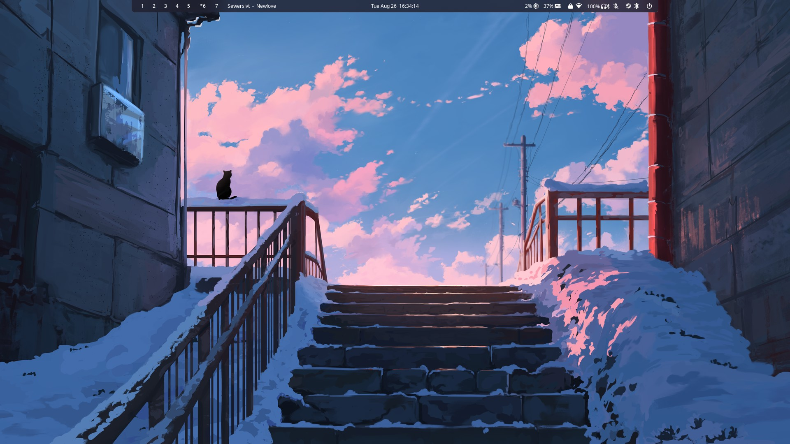
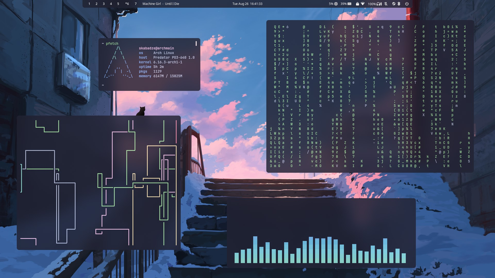

# arch-hyprland-dots
My arch linux + hyprland dots.
Some config files may be a bit messy and disorganised/inefficient these dots are just for personal use and not intended for public use.

# screenshots

